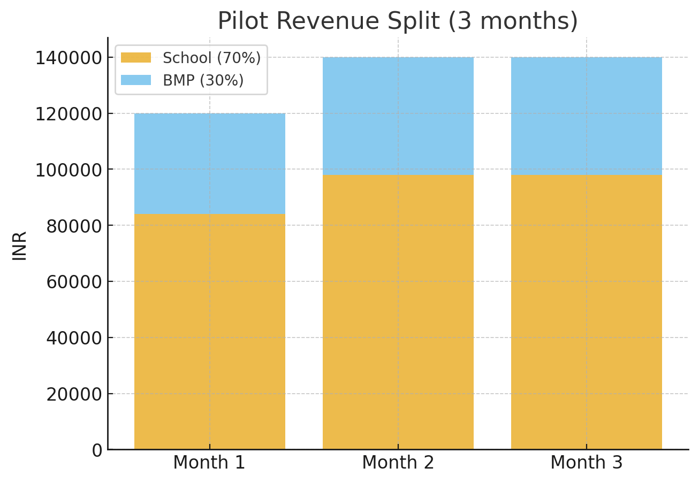

# BookMyPlay — PM Case Study

## Pilot & Early Traction (real execution)
To validate supply-demand fit, BMP ran 3-month pilots with two schools in Delhi NCR:

- Dayanand Model School  
- Queens Global International School

Contract structure: 3-month operating contracts where BMP managed bookings and operations; schools received 70% of profits during the pilot.

Execution (no app, no paid marketing):
- Filled daily cricket & football slots via WhatsApp groups and school outreach.
- Hosted corporate tournaments and intra-school events to seed demand.
- Managed scheduling manually via spreadsheets and confirmations over WhatsApp.

Results (3-month pilot):
- INR 4,00,000 earned from combined tournaments and daily bookings.  
- Profitable from Day 1, despite sharing 70% of profits with schools.

Vision & Deal Pathways (explicit):
- **Option 1 (Partner & Transfer):** School invests and is partner (70% revenue share) during contract; at contract end school becomes sole owner (100% profit) and BMP converts to commission-per-booking on the BMP platform.
- **Option 2 (BMP-funded Capex + Lease):** BMP invests in infrastructure and secures a 10+ year exclusive lease at market rent (e.g., ₹40k–₹50k/month).

## 8) Visuals & Financial Model

**Pilot Revenue Split (3 months):**  

**Financial Model (10-year scenarios):**  
See [`assets/financial-model.xlsx`](assets/financial-model.xlsx) for detailed payback analysis under:
- Path A (Partner & Transfer — School invests, 70% share → sole ownership later)
- Path B (BMP-funded Capex + Lease — BMP invests, pays fixed rent, exclusive rights)
